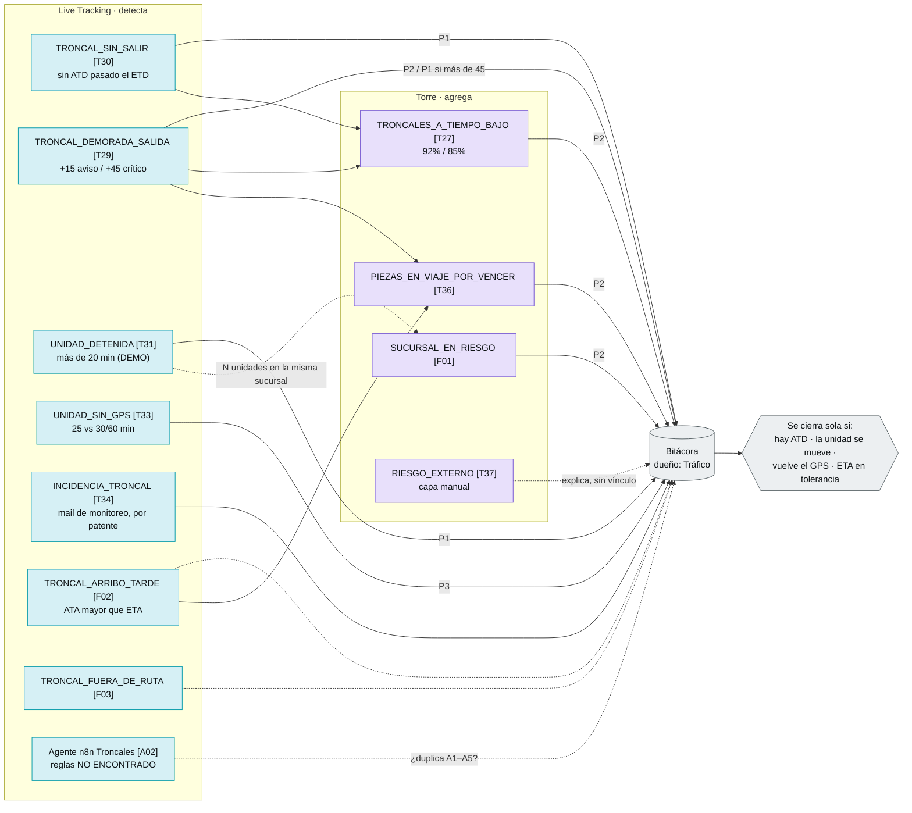
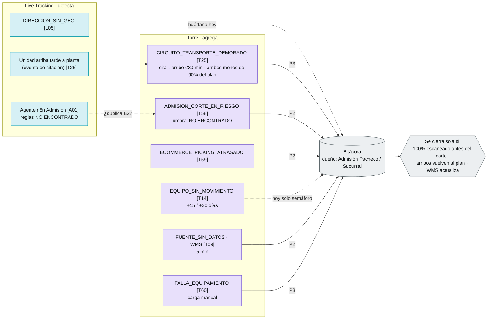
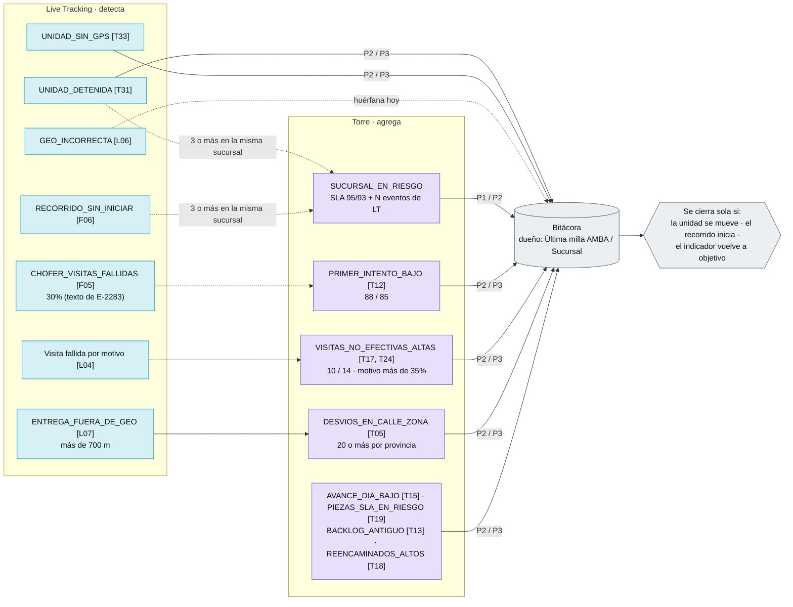
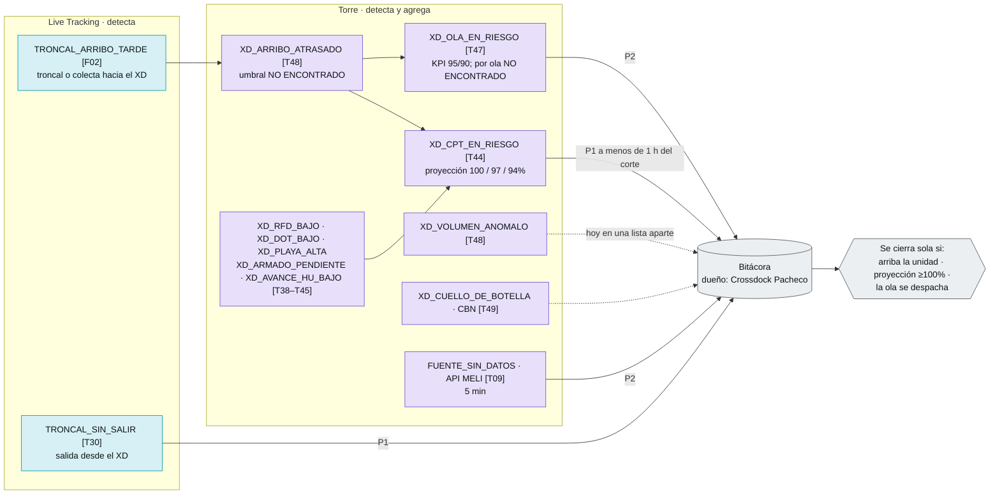
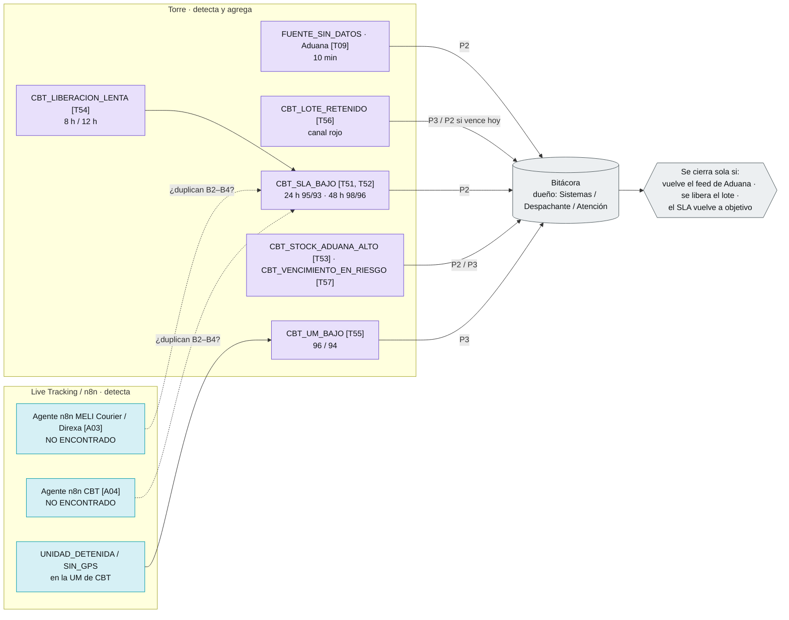

# Flujos de alertas por proceso

Cómo leer los diagramas:
- **Celeste:** lo que detecta LT (unidad, viaje, troncal; minutos).
- **Violeta:** lo que detecta la Torre (agregados y cruce de fuentes).
- **Gris:** la Bitácora, que es la única cola de gestión.
- **Línea punteada:** lo que falta (FALTANTE) o lo que no está confirmado.
- Los códigos son los de `catalogo_propuesto.csv`. Los IDs entre corchetes (T29, L07…) remiten a `inventario_alertas.csv`.

Reglas comunes a todos los procesos (hoy en `torre/index.html`):
- **Vencimiento:** P1 2 h, P2 4 h, P3 8 h (`:1978`).
- **Estados:** nueva → reconocida → en gestión → resuelta → cerrada con causa (`:1955`).
- **Contingencia:** escala las P1 al Jefe de turno (`:2513`).
- **Lo que falta en todos:** el autocierre y el escalado por vencimiento (F04, F07).

---

## 1. Troncales

**Lectura:**
- Todo lo que pasa sobre una troncal o una unidad lo tiene que detectar LT. Hoy la Torre calcula la demora por troncal (T29, T30) y además el color de la troncal en el mapa depende solo de las excepciones abiertas (`:1098`), no de la demora.
- Antes de unificar hay que resolver dos conflictos. La tolerancia es de 15 min en el código y de 20 min en el KPI. La definición de "a tiempo" mide el arribo (ATA) y el código mide la salida (ATD).
- La única alerta que hoy entra sola a la Bitácora es la unidad detenida (E-2293, simulada en `:2645`). Ese es el patrón a replicar.

---

## 2. Admisión

**Lectura:**
- Admisión depende de cortes y volumen por cliente, así que lo detecta la Torre. LT solo aporta la llegada de la unidad a planta.
- El corte de admisión (E-2286) no tiene regla ni umbral: es un ejemplo cargado a mano. Hay que confirmar si el agente n8n de admisión ya lo detecta (posible DUPLICADA).

---

## 3. Última milla

**Lectura:**
- Es el proceso con más indicadores con semáforo en la Torre (T11–T26) y casi ninguno abre una excepción: son HUÉRFANAS.
- LT tiene el dato por parada y por chofer (visitas fallidas, geo, desvío de 700 m) pero no lo alerta. Ese dato debería alimentar la alerta agregada SUCURSAL_EN_RIESGO, que hoy no existe (F01).
- Hay que unificar la lista de motivos de no entrega entre LT y la Torre.

---

## 4. Crossdock

**Lectura:**
- El crossdock es casi todo de la Torre: cortes, CPT y volumen. La relación clave es que una troncal o colecta atrasada (LT) eleva el riesgo del CPT y de la ola.
- Las "excepciones del crossdock" (subidas o bajas de volumen, atraso de ETA, `:1804`) hoy viven en una lista separada y no entran en la Bitácora. Hay que llevarlas a la cola única.

---

## 5. Courier / CBT (incluye MELI Courier / Direxa)

**Lectura:**
- CBT cruza aduana, cliente y vencimiento, así que se detecta en la Torre. LT solo aporta la última milla.
- Hay que confirmar si los agentes n8n de CBT y MELI Courier/Direxa miden lo mismo que T51 a T56. Si es así, son DUPLICADAS y debería quedar una sola fuente de la alerta.
- El conflicto a resolver es el SLA 24 h (T51) contra el tiempo de liberación de 8/12 h (T54).
